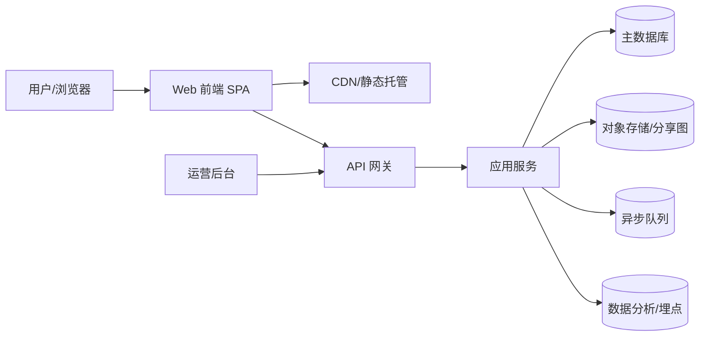
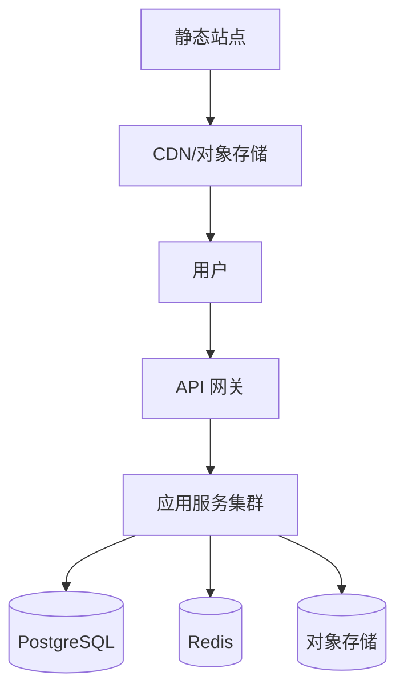

# 认知五层测评与成长系统｜架构设计文档

版本：v1.0  
范围：MVP 至可扩展形态  
目标：支撑测评、结果、成长工作台、分享与日志能力，保证可迭代与可扩展。

## 1. 系统总体架构图

## 2. 技术选型说明

- 前端：HTML/CSS/JS（MVP）→ React/Next.js（迭代）
- 后端：Node.js + Fastify（轻量 API）或 NestJS（模块化）
- 数据库：PostgreSQL（关系数据与统计）
- 缓存：Redis（排行榜、会话、限流）
- 对象存储：S3 兼容（分享图、证书）
- 任务队列：BullMQ/Redis Streams（生成分享图、成长报告）
- 监控：OpenTelemetry + Grafana
- 部署：Docker + Nginx，后续 Kubernetes

## 3. 核心模块划分

1. 测评系统  
   - 题库管理、测评会话、评分与层级计算  
2. 结果系统  
   - 画像生成、标签与建议、分享图  
3. 成长系统  
   - 跑题器、模型卡片库、认知日志  
4. 用户系统  
   - 账号、历史记录、成长轨迹  
5. 运营系统  
   - 题库运营、活动与挑战配置  
6. 数据分析  
   - 完成率、层级分布、留存与传播

## 4. 数据流设计

1. 用户进入测评 → 前端拉取题库 → 本地渲染  
2. 用户提交答案 → API 评分 → 返回主层级/次层级/一致性  
3. 结果页生成 → 前端展示 → 分享图异步生成  
4. 跑题器交互 → 结构化输出 → 存档为认知日志  
5. 日志与成长报告 → 定时任务汇总 → 推送用户

## 5. 接口规范（示例）

### 5.1 题库与测评
- `GET /api/v1/assessments`  
  - 返回题库元信息与题目列表
- `POST /api/v1/assessments/submit`  
  - 入参：answers[], sessionId  
  - 出参：level, secondaryLevel, scores[5], consistency

### 5.2 结果与分享
- `GET /api/v1/results/{resultId}`  
  - 返回层级结果、标签、建议、雷达图数据
- `POST /api/v1/share/cards`  
  - 入参：resultId  
  - 出参：shareImageUrl

### 5.3 跑题器与日志
- `POST /api/v1/runner`  
  - 入参：rawProblem, steps[]
  - 出参：reportId, structuredReport
- `GET /api/v1/logs`  
  - 返回用户历史日志

## 6. 安全策略

- 传输加密：HTTPS 全站
- 身份认证：JWT + 刷新令牌
- 数据隔离：用户级鉴权与访问控制
- 反滥用：限流与频率控制
- 内容合规：UGC 过滤与举报机制
- 隐私保护：最小化采集、可导出与删除

## 7. 性能指标

- 关键页面首屏：≤ 1.5s（CDN）
- API P95 延迟：≤ 200ms
- 测评完成率：≥ 70%
- 分享卡生成：≤ 5s 异步完成

## 8. 可扩展性方案

- 题库与模型卡片独立服务化
- 评分与结果生成可拆分为独立服务
- 报告与分享图用异步队列扩展
- 多地区部署与 CDN 加速

## 9. 部署架构

## 10. 评审与迭代机制

- 每阶段交付后组织评审会议  
- 参与人：产品、前端、后端、设计、运营  
- 输出：需求修订、技术风险清单、优先级调整
