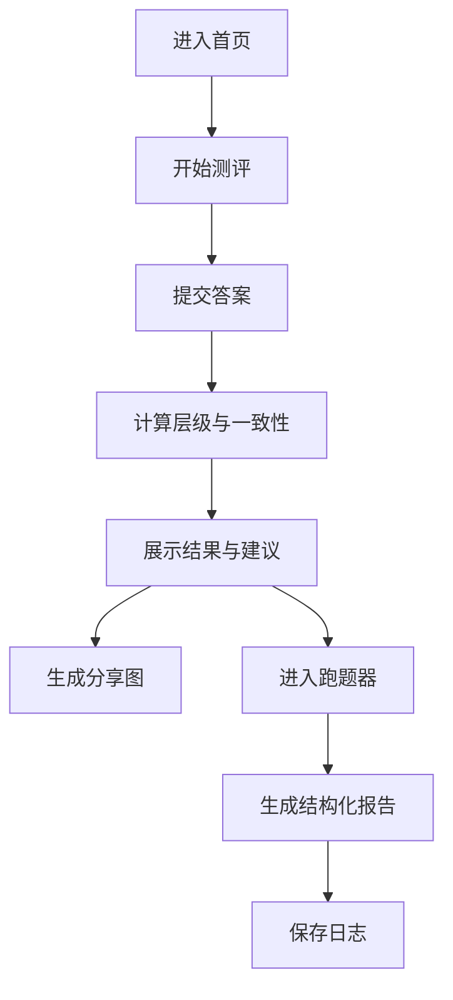

# 认知五层测评与成长系统｜产品需求文档（PRD）

版本：v1.0  
目标：基于五层认知模型，帮助用户快速测评认知层级，并持续提升判断与决策能力。

## 1. 产品背景与目标

### 背景
用户面对复杂问题时缺少结构化判断工具，无法稳定输出高质量决策。五层认知模型提供可复用流程与自我纠偏机制，适合落地为可持续使用的产品。

### 目标
- 3–5 分钟完成认知测评  
- 输出清晰可分享的认知画像  
- 提供可持续训练机制  
- 提升用户留存与裂变传播

## 2. 用户画像

1. 自我提升型  
   - 关注思维效率与判断力  
2. 复杂决策型  
   - 工作/关系中频繁做关键判断  
3. 内容学习型  
   - 有阅读与模型学习习惯

## 3. 功能需求列表（按优先级）

### P0（必须）
- Landing Page：核心价值与 CTA  
- 认知层级测评  
- 结果页（层级、建议、可分享）  
- 跑题器（五层引导）  
- 日志保存（本地或账号）

### P1（重要）
- 模型卡片库  
- 成长挑战（每日问题）  
- 分享图生成  
- 历史测评记录

### P2（可选）
- 7 天挑战证书  
- 分享墙与互动  
- 周/月成长报告

## 4. 非功能需求

### 性能
- 首屏加载 ≤ 1.5s  
- 测评提交响应 ≤ 200ms  

### 可用性
- 移动端适配  
- 断网可读核心内容

### 安全性
- 账号安全与隐私保护  
- 用户数据可导出与删除

## 5. 用户旅程地图

1. 触达：看到分享内容或搜索进入  
2. 了解：浏览 Landing Page，理解价值  
3. 行动：进入测评并完成  
4. 收益：获得画像与建议  
5. 复访：进入跑题器与模型库  
6. 传播：分享画像或证书  

## 6. 核心业务流程图

## 7. 原型图描述

1. 首页  
   - 标题 + 副标题 + CTA  
2. 测评页  
   - 题目卡片 + 进度条 + 提交  
3. 结果页  
   - 雷达图/条形图 + 画像标签 + 建议  
4. 成长工作台  
   - 跑题器输入区 + 模型卡片  
5. 个人档案  
   - 历史测评 + 日志列表

## 8. 验收标准

- 测评流程完整且可在 5 分钟内完成  
- 结果页包含层级、建议与可分享内容  
- 跑题器可输出结构化判断报告  
- 日志可查看与复用  

## 9. 里程碑计划

1. 第 1 周：需求确认与原型  
2. 第 2–3 周：测评与结果页  
3. 第 4 周：跑题器与模型库  
4. 第 5 周：分享图与日志  
5. 第 6 周：测试、上线与优化  

## 10. 风险分析

- 题库质量影响测评可信度  
- 分享机制不具备足够动机  
- 训练机制过重导致留存低  
- 结果解释过于抽象影响理解

## 11. 评审与迭代计划

- 每阶段交付后组织评审会议  
- 参与人：产品、设计、研发、运营  
- 评审内容：价值一致性、交互完成度、技术可行性  
- 产出：需求调整与优先级变更
